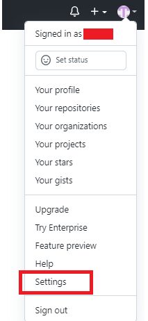
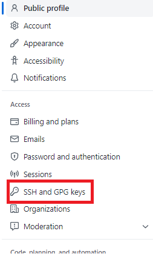
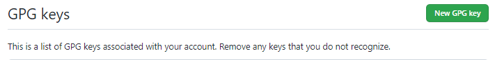
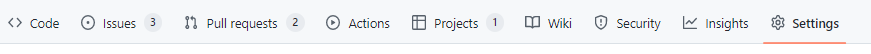
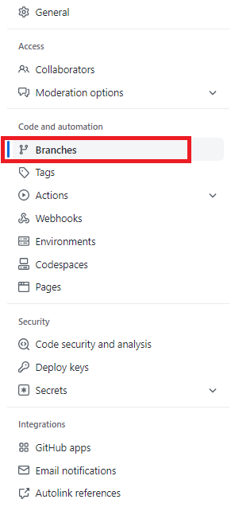
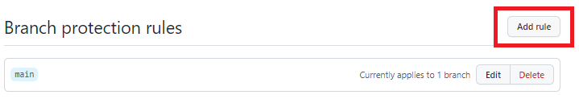

[![Contributors][contributors-shield]][contributors-url]
[![Forks][forks-shield]][forks-url]
[![Stargazers][stars-shield]][stars-url]
[![Issues][issues-shield]][issues-url]
[![Commits][commit-shield]][commit-url]
[![Integration tests][build-shield]][build-url]
[![Licence][licence-shield]][licence-url]
[![Website][website-shield]][website-url]
[![Build][milestones1-shield]][milestones1-url]
[![Finetunning][milestones2-shield]][milestones2-url]

<br />
<p align="center">

  <h1 align="center">Projet Git</h3>

  <p align="center">
    Repo for Git best practices.
    <br />
    <br />
    <a href="https://github.com/sDev67/projet_git/issues/new?assignees=&labels=bug&template=bug_report.yml&title=%5BBug%5D%3A+">Report Bug</a>
    ·
    <a href="https://github.com/sDev67/projet_git/issues/new?assignees=&labels=feature&template=feature_request.yml&title=%5BFEATURE%5D%3A+">Request Feature</a>
    .
  </p>
</p>

<!-- TABLE OF CONTENTS -->
<details open="open">
  <summary>Table of Contents</summary>
  <ol>
    <li>
      <a href="#project-delivery">Project Delivery</a>
    </li>
    <li>
      <a href="#about-the-project">About The Project</a>
      <ul>
        <li><a href="#built-with">Built With</a></li>
      </ul>
    </li>
    <li>
      <a href="#getting-started">Getting Started</a>
      <ul>
        <li><a href="#prerequisites">Prerequisites</a></li>
        <li><a href="#installation">Installation</a></li>
      </ul>
    </li>
    <li><a href="#contact">Contact</a></li>
  </ol>
</details>

## Project delivery

### Commits signés de tous les membres et sur tous les commits
Pour cela, on installe premièrement https://www.gnupg.org/download/ et on crée notre clé GPG<br>
On effectue la commande `gpg --full-generate-key` <br>
Puis on choisi `clé RSA` parmi les clés proposées <br>
Ensuite on indique la taille de la clé : `4096` <br>
Puis on sélectionne `0` pour que la clé ne s'expire jamais <br>
Puis on confirme que les informaitions sont correctes avec un `y` <br>
Ensuite on renseigne le nom d'utilisateur qui doit être identique au nom présent dans la config, l'adresse mail, et un commentaire <br>
Pour finaliser la création de la clé, il faut choisir : `o` <br>
Après avoir renseigné cela, toujours dans le terminal, on saisi la commande `gpg --list-secret-keys --keyid-format=long` <br>
On copie l'identifiant situé après le slash dans la ligne `sec` <br>
Puis on execute la commande `gpg --armor --export L862717XYZ98P123` avec L86.... l'identifiant copié au préalable <br> <br>
Puis on renseigne cette clé sur github. <br>
  - Aller dans les paramètres <br>
 <br> 
  - puis SSH and GPG keys <br>
<br> 
puis ajouter une nouvelle clé GPG <br>
 <br>

Après avoir ajouté la clé sur github, il faut ajouter dans la config de notre terminal, les informations de cette clé. <br>
Faire : `git config --global user.signinkey {identifiant}` <br>
Puis, pour que chaque commits soit signés, executer la commande : `git config --global commit.gpgsign true` <br>
Ainsi, tous nos prochains commit seront automatiquement signé

### Issue + issue templates
*To complete*
### Merge Request + Merge Request template
*To complete*
### Github project
*To complete*
### Un readme, contributing, code of conduct correctement rédigés
*To complete*
### Un .gitignore cohérent
*To complete*
### Respect du Git flow (les bonnes branches et les bonnes protection de branche)
Mise en place de branches feature/xxxx, develop et hotfix <br>
Pour avoir un environnement de travail et une branche main sécurisé, il faut mettre en place quelques règle pour la protection. <br>
  - Pour cela aller dans `setting` de votre repo <br>
 <br>
  - Puis dans `branches` <br>
 <br>
  - Puis vous pouvez ajouter une nouvelle règle sur la branche souhaité, éditer vos règles déjà présente ou bien supprimer des protections déjà existante <br>
 <br>

Dans la branche `main`, on a décidé de mettre les règles suivantes : <br>
- `Require a pull request before merging` <br>
Cette règle nous oblige à effectuer une pull/merge request avant de merger sur la branche main <br>
- `Require approvals` <br>
Après avoir effectuer une pull request, on doit avoir au moins 1 personne qui approuve la pull request <br>
- `Require status checks to pass before merging` <br>
Permet de merge uniquement lorsque tous les tests sont passés <br>
- `Require branches to be up to date before merging` <br>
Oblige à avoir la dernière version avant de pouvoir merge <br>
- `Require signed commits` <br>
Les commits effectués sur main doivent tous être signés <br>
- `Require deployments to succeed before merging` <br>
*to complete* <br>
- `Allow force pushes` <br>
Nous autorise à effectuer des pushs forcés. <br>
- `Specify who can force push` <br>
On indique qui sont les utilisateurs qui peuvent effectuer des pushs forcés <br>

### Un hooks qui vérifie un code js (linter) 
*To complete*

### Une CI / Github Actions
*To complete*

### Synchro sur un repo gitlab
*To complete*

### Avec la commande "git push" -> push sur les 2 remote (github + gitlab)
Pour push sur deux remote à la fois avec un git push, il faut dans un premier temps ajouter les deux remote : 
```
git remote add github https://github.com/sDev67/projet_git.git
git remote add gitlab https://gitlab.com/hkanoute/projet_git.git
```
Une fois cela fait, il faut indiquer sur quel remote push : 
```
git remote set-url --add --push origin https://github.com/sDev67/projet_git.git
git remote set-url --add --push origin https://gitlab.com/hkanoute/projet_git.git
```
Une fois cela fait, vous pouvez push sur les deux remotes avec un git push.

## About The Project

This repo is a project rendering that serves to demonstrate the good practices of Git and Gihub.

### Built With

- Html
- Scss
- JavaScript
- Vite

### License

[MIT](https://github.com/sDev67/projet_git/blob/feature/readme/LICENSE)

<!-- GETTING STARTED -->

## Getting Started

### Prerequisites

- Install [Git](https://git-scm.com/)
- Install [Docker](https://www.docker.com/).

### Local Development

1. Build the docker image and start the container :

    ```bash
    docker-compose build # Build the conainer
    docker-compose up -d # Run the container
    ```

2. Get into the container :

   ```bash
    docker exec -ti projet-git-node-1
    ```

    <b style="text-decoration: underline;">You will need to run all the project commands into the container.</b>

3. Install the local server, then run it :

    ```bash
    npm install # Install the local server and the dependencies
    npm start # Start the server
    ```

4. Open [http://localhost:8000/](http://localhost:8000/)

### Run styles compilation

Style compilation is made with **Sass**. To run it, use :

```bash
$ cd sources
/sources $ sass --watch scss/styles.scss css/style.css
```

### Run tests

#### Run cypress

```bash
npx cypress run # To execute the test
npx cypress open # Open the GUI (dont work in container)
```

#### Run js linter

```bash
npm run lint-js
```

<!-- CONTACT -->

## Contact

👤 **Nicolas Barbarisi** :

- [](https://nicolas-barbarisi.com)
- [](https://github.com/ChrisBradford2)
- [](https://www.linkedin.com/in/nicolas-barbarisi-a4a97a193/)

👤 **Hamidou Kanoute**

- [](https://github.com/hkanoute)
- [](https://www.linkedin.com/in/hamidou-kanoute/)

👤 **Serkan Deveci**

- [](http://serkan-deveci.herokuapp.com/fr)
- [](https://github.com/ChrisBradford2)
- [](https://www.linkedin.com/in/serkan-deveci-6086aa217/)

[contributors-shield]: https://img.shields.io/github/contributors/sDev67/projet_git.svg?style=for-the-badge
[contributors-url]: https://github.com/sDev67/projet_git/graphs/contributors
[forks-shield]: https://img.shields.io/github/forks/sDev67/projet_git.svg?style=for-the-badge
[forks-url]: https://github.com/sDev67/projet_git/network/members
[stars-shield]: https://img.shields.io/github/stars/sDev67/projet_git.svg?style=for-the-badge
[stars-url]: https://github.com/sDev67/projet_git/stargazers
[issues-shield]: https://img.shields.io/github/issues/sDev67/projet_git.svg?style=for-the-badge
[issues-url]: https://github.com/sDev67/projet_git/issues
[build-shield]: https://img.shields.io/github/workflow/status/sDev67/projet_git/Node.js%20CI?style=for-the-badge
[build-url]: https://github.com/sDev67/projet_git/actions/workflows/node.js.yml
[licence-shield]: https://img.shields.io/github/license/sDev67/projet_git?style=for-the-badge
[licence-url]: https://github.com/sDev67/projet_git/blob/main/LICENSE
[website-shield]: https://img.shields.io/website?down_color=red&down_message=down&style=for-the-badge&url=https%3A%2F%2Fchrisbradford2.github.io%projet_git%2F
[website-url]: https://venom-linux.xyz
[milestones1-shield]: https://img.shields.io/github/milestones/progress-percent/sDev67/projet_git/1?style=for-the-badge
[milestones1-url]: https://github.com/sDev67/projet_git/milestone/1
[milestones2-shield]: https://img.shields.io/github/milestones/progress-percent/sDev67/projet_git/2?style=for-the-badge
[milestones2-url]: https://github.com/sDev67/projet_git/milestone/2
[commit-shield]: https://img.shields.io/github/commit-activity/m/sDev67/projet_git?style=for-the-badge
[commit-url]: https://github.com/sDev67/projet_git/commits/